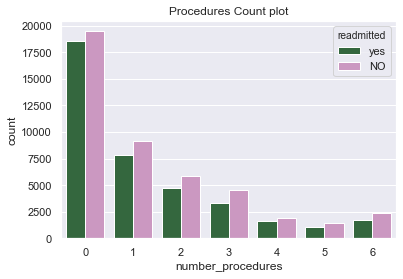
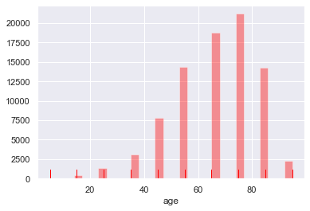
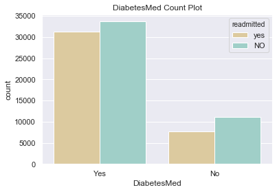
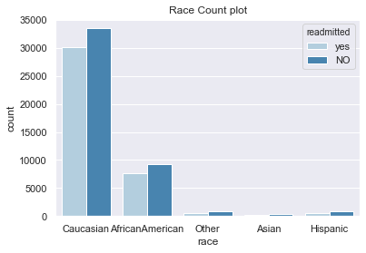

# Summary

The average age of people having diabetes is 45 years old. On this project, I want to see classify if meidcation provided by doctors will reduce patients going back to the hospital. The data has over 80,000 entries and the models performed are Decision Tree and Random Forest.

# Exploratory Data Analysis

# Model Evaluation
I used a 70/30 training test data split to evaulate the model
Decision Tree = with the amount of features provided, I think this model would appropriate
Random Forest = a group of decision tree that predicts the best outcome.

Decision Tree Results:

              precision    recall  f1-score   support

          NO       0.62      0.62      0.62     13441
         yes       0.56      0.57      0.56     11683

Random Forest Results:

              precision    recall  f1-score   support

          NO       0.67      0.74      0.70     13441
         yes       0.66      0.58      0.61     11683
 

